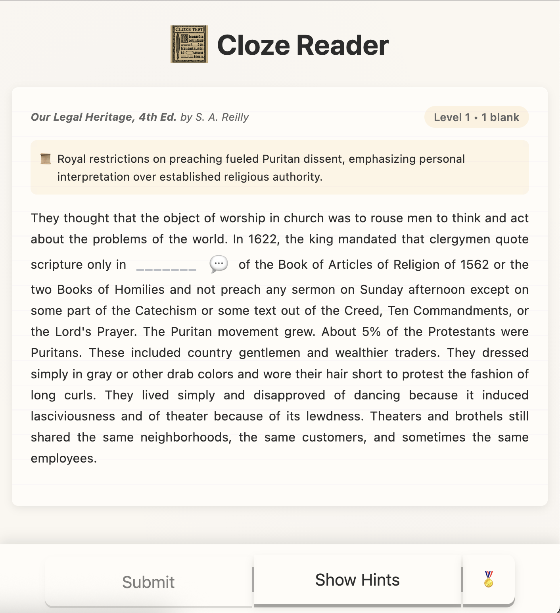

# Fill in the Blank and Cloze Reader's Twin Histories of Occlusion
**Zach Muhlbauer**
The Graduate Center, CUNY
<https://reader.inference-arcade.com>
Site deployment <https://milwrite.github.io/quimbot/cloze-reader-draft/>

# Abstract

Wilson Taylor's cloze procedure began as a classroom test in which a teacher or researcher deletes words from prose and prompts readers to recover them from context. Machine-learning researchers later turned missing-word prediction into a pretraining objective, hiding tokens across large corpora and training models to infer them from surrounding text. In Cloze Reader, a browser game I built through the CUNY AI Lab and the Inference Arcade initiative, I give the language model a narrower job. Through prompt rules and validation checks I limit the model to one or more words from a Project Gutenberg passage, and through level settings and hint limits I tune the difficulty of each round. I then anchor the player at the blank with the title, passage, sentence, and cues still visible. The player recovers the word through grammar, genre, historical setting, and the immediate pressure of the sentence. Each round returns corpus material to prose, where the player's reading on the page tests the model's prediction.
# Introduction

In 1953, Wilson Taylor turned the Gestalt idea of closure into a reading test by deleting words from prose and having readers recover each one from the surrounding passage. To answer, a reader inferred the missing word from the grammar and cues of the visible sentence. Taylor read his results as evidence that contextual prediction measured comprehension more precisely than formulas based on sentence and word length.
In masked language modeling, researchers hide tokens across a corpus and train a model to predict them from the surrounding words, adjusting the model's weights at each error. I make that split visible to the player: my prompt rules direct the model to choose a word from a Project Gutenberg passage, and I present the blank with the passage, book title, level cues, and hint limits still visible. I draw on Project Gutenberg because the same public-domain books circulate as library texts and as model-training material. Readers encounter them as titled works with genres, publication histories, sentences, and scenes, while corpus builders handle the same volumes as extractable text. The Pile, for example, is an 825 GiB English corpus built from twenty-two subsets, including a Gutenberg component drawn from PG-19, a set of pre-1919 Project Gutenberg books used for long-context language modeling (Gao et al. 2020). I limit the claim to collection level, where Gutenberg is corpus material and I bring one passage back to the player as a sentence from a book.
# The Educational Genealogy of Cloze

Taylor's procedure looked simple on the page. In a fixed-ratio cloze test, the researcher deletes every nth word from a passage and has the reader recover the missing term, and Taylor treated the recovered word as evidence of comprehension because the reader who supplies it draws on the prior clause, the likely continuation, the passage topic, and the grammar of the blank. To answer, the reader retains the visible sentence, judges which kind of word can fit the opening, and chooses a term that fits the passage. Taylor drew this design from the Gestalt tradition of Wertheimer, Köhler, and Koffka, whose account of closure Koffka set out systematically (Koffka 1935): a viewer still completes a broken form from the visible contour around it, and Taylor adapted that logic to prose, where a deleted word leaves enough surrounding shape for a reader to work. Oller (1979) later called the linguistic version of that coordination "pragmatic expectancy grammar," the knowledge readers use to anticipate likely next words in a well-formed utterance, and with that account he repositioned cloze from a readability metric to a general index of linguistic competence. On that view, when a deleted word interrupts a sentence, the reader draws on the whole of that competence and answers from the visible context.
Two questions shaped how researchers refined the method, beginning with scoring. Exact-word scoring anchors the rating to the author's original word and yields high agreement between raters, and synonym scoring credits a word that fits the same local meaning, honoring the semantic flexibility that Oller's account implies (Jongsma 1980). A reader who gives a semantically apt synonym has shown comprehension, and synonym scoring is designed to record that achievement. Abraham and Chapelle (1992) carried the analysis further by treating item difficulty as part of what a cloze score means, since each blank samples its own mixture of grammar, vocabulary, and passage-level inference. The second question concerned which words to delete. Bachman (1985) developed rational deletion, choosing words by their inferential salience so that the test concentrates on the sites where context does the most work. I take up both questions at the scale of the single blank: through prompt rules I define the candidate site by difficulty, part of speech, word length, and passage position, then check in validation code whether the chosen word can bear that work.
NLP researchers adopted cloze through purpose-built test datasets. Xie et al. (2018) assembled CLOTH from middle-school and high-school language exams, where teachers had already written the blanks and answer choices to test passage-level inference. The ACL record describes CLOTH's blanks as "carefully created by teachers" and its candidate choices as "purposely designed to be nuanced," and that provenance ties the benchmark to classroom exam design even as NLP researchers repurpose it. Xie et al. characterize the dataset as demanding "deeper language understanding" and a "wider attention span" than earlier automatically generated cloze sets, so the teacher-made items carry forward assumptions about what readers should infer, how much context they should draw on, and where a wrong answer marks weak comprehension. Traced from readability research through standardized testing to NLP benchmarks, CLOTH brings classroom cloze and model evaluation into the same frame, and one practical question remains open across all three: when does restoring a missing word genuinely test reading?
# The Machine Learning Genealogy

Machine-learning researchers reached cloze through distributional accounts of language, where a word's structure comes from the contexts in which it appears. Harris (1954) treated co-occurrence as evidence of grammatical patterning, and Firth (1957) carried co-occurrence toward meaning by arguing that a word's company shapes what the word can mean. Given that recurring neighbors mark grammatical and semantic relations, researchers can train a system on enough text to track where words appear around one another. With word2vec, Mikolov made prediction the engine of that account, training shallow networks to infer surrounding context from a target word and to infer a target word from surrounding context (Mikolov et al. 2013); his skip-gram and continuous-bag-of-words objectives turned local prediction into dense vectors that captured syntactic and semantic regularities at scale. In word2vec, each word had a single vector across all its uses, so a word such as bank carried the same identity whether it appeared near account or near river, and that property set the agenda for the context-sensitive models that followed.
Peters et al. (2018) tied representation to sentence context with ELMo, assigning each token a representation that depends on "the entire input sentence" through bidirectional language modeling: they ran a forward pass and a backward pass and joined the two. Devlin et al. (2019) then trained BERT to predict masked tokens while "jointly conditioning" on left and right context in every layer, so that within one transformer encoder pass each position could attend to all the others at once. Devlin et al. trace the inheritance directly, calling masked language modeling a task "often referred to as a Cloze task" and citing Taylor in the same paragraph; in their implementation they mask 15 percent of WordPiece tokens at random and predict the original vocabulary item at each masked position. Masking scaled because unannotated text already contained the training signal, with large corpora providing enough examples for pretraining (Liu et al. 2021, Bommasani et al. 2021), and the cloze form moved from a human response sheet into an automated training loop where researchers use millions of blanks to train a model to distribute expectation across text. Zhang and Hashimoto (2021) probed what that random masking actually teaches and found that its gains come less from cloze-like lexical masks than from generic masking, whose objective corresponds to methods for learning the statistical dependencies among words, so the inheritance from Taylor's deliberate deletions to BERT's random masks runs looser than the shared cloze label suggests. Taylor used deletion to test whether a reader could coordinate the meaning of a passage; Devlin and his colleagues used masking to build a model's internal representations. With the first procedure Taylor measured a reader's performance; with the second Devlin's team trained a system.
Researchers have recently documented the asymmetry between the two activities. Xie et al. reported teacher-authored cloze items on which model performance lagged human test takers on exam-style blanks, and Jacobs, Grobol, and Tsang (2024) compared language-model predictions with human cloze productions at the level of single-token completions. They report that models under-estimate human responses, over-rank rare responses, under-rank top responses, and form semantic patterns of their own. Other researchers turn the model toward making cloze items rather than answering them, since Matsumori et al. (2023) generate open cloze questions for language learners with a masked language model and Ondov, Attal, and Demner-Fushman (2024) align an MLM's objectives to produce reliable cloze distractors, so the same prediction machinery that masking produced now composes the blanks that human readers face. I take a modest lesson from that work: human cloze completion and model token prediction share a surface form, the one a cognitive act and the other a technical one. I use the model's prediction capacity to choose where the blank appears, then prompt the player to recover a word inside a titled passage, with the sentence's meaning and the book's context still in view.
# Cloze Reader

In Cloze Reader, a round begins with a book passage, a title, and a source record. In public source modules I document my passage retrieval through the Hugging Face Datasets API (Cloze Reader 2026a) and my calls to the open-weight Gemma-3-27B model, served through OpenRouter, for word selection, hints, and contextualization (Cloze Reader 2026b). From the manu/project_gutenberg dataset, a collection of more than seventy thousand public-domain texts on Hugging Face, I stream records continually, and I fall back to roughly ten embedded classics whenever a stream stalls, extracting title and author metadata wherever the record allows. I also clear away Gutenberg headers, scanning notes, URLs, chapter lists, page numbers, bracketed notes, and other lines that would push a cloze round toward metadata work and away from reading (Cloze Reader 2026a). From the interior of a book I then draw a passage of about a thousand characters, sampling between the thirtieth and eightieth percentile across as many as eight attempts, and I reject front matter, tables of contents, all-capital noise, reference patterns, number-heavy lines, and brittle formatting before scoring what remains. A quality score weighs capitalization ratio, numeral density, punctuation load, sentence length, repeated phrasing, and typographic noise such as pipes, brackets, and numbered lists, while a separate check screens out dictionary and etymological material, including hash marks, bracketed glosses, and abbreviations such as OE., OFr., L., and ME., so I build the round only after the passage shows enough sentence structure to support a blank (Cloze Reader 2026c). Those filters narrow the archive before the model predicts a word, so the player receives a passage that can still be read as prose.

<em>Figure 1. A Cloze Reader round in use. I present a passage from Our Legal Heritage, 4th Ed. by S. A. Reilly at Level 1 with one blank. The blank falls inside a discussion of royal preaching restrictions and Puritan dissent, and the hint panel remains available.</em>
<em>Figure description. A historical prose passage appears with one blank and a hint control. The blank anchors a local lexical decision inside a passage with legal and religious context.</em>
I route each round through word selection before any blank appears. In the public aiService.js module I record my call to google/gemma-3-27b-it, issued at temperature 0.5 within a token budget of roughly 150 to 200 for a single passage and 800 for a batch, along with the selection prompt that calls for exact lowercase words drawn from the middle or end of a passage while skipping the opening words and avoiding compounds (Cloze Reader 2026b). I prompt the model to return its choices as a JSON array, and I parse them down a cascade from the message content through the model's reasoning fields to a regular-expression fallback, so a stray wrapper or an aside cannot derail the round (Cloze Reader 2026b). Through that prompt I limit candidates by length, difficulty, and part of speech, then confirm in a validation layer that the chosen words appear in the passage, reject concatenation artifacts such as fromthe and tothe, and check that each word satisfies those constraints; when the model continues to produce unusable results, I fall back on excluding roughly sixty common function words and distributing the blanks evenly across the passage (Cloze Reader 2026c). By putting the pedagogical aims in the prompt I turn them into a procedure the model has to satisfy before the player sees a puzzle, and I make the selection logic legible, since difficulty, word length, part of speech, and passage position all appear as readable parts of the instruction, open to inspection and revision. A fixed-ratio test settles these choices by arithmetic, deleting every fifth or seventh word by position alone, whereas I settle them through a stated prompt that directs the model while I audit the answer in validation code.
I also separate selection from hinting because each model call carries its own pedagogical risk. At selection time I send Gemma only the selection call, and I build the later hint call around the blank after I have stored the selected word in game state. If I shared context between the two, selection would drift toward words the hint stage handles easily, so I run word selection, hint generation, and passage contextualization as separate calls, and I give each only the passage text and the instructions for one task (Cloze Reader 2026b). I store the model's output in game state once, and the next call begins from a fresh instruction. The contextualization call works on the same principle, returning a single literary or historical insight of twenty-five words or fewer with no dashes and no preamble (Cloze Reader 2026b). Thinking through a smaller-model substitution clarified where each task's difficulty lives. Word selection proves largely reproducible from frequency scores and part-of-speech tags, since I already check lowercase form, passage position, length, and word presence in code. Hint generation places a stricter demand: I give the model the answer privately at temperature 0.7 and require it to guide the player in twenty-five words or fewer, dropping to fifteen for a synonym, while a safety directive embedded in the prompt names the hidden word and forbids the model from stating it directly, so the target word and its near equivalents remain out of the reply. I assemble the puzzle from these separate procedures, each one narrow enough to inspect even as the model's learned distributions elude a clear view.
## Smaller Models and Task Boundaries
Smaller models clarify where the boundary between model choice and code checks actually falls. In my implementation word selection leans most on the model, though I enforce hard constraints in code after generation. The chosen word must appear in the passage, match the target length, avoid the opening words, and survive validation before the round proceeds (Cloze Reader 2026c). Because those checks already carry so much of the load, a frequency table and a part-of-speech tagger can reproduce most of word selection, leaving a model to choose among the remaining candidates. I tested how far that compression can go by distilling the whole pipeline into a much smaller student, cloze-reader-qwen3.5-0.8b-lora, a rank-16 adapter over Qwen3.5-0.8B trained on the outputs of the Gemma-3-27B teacher across all four tasks the app runs: word selection, batch selection, hint generation, and contextualization (Muhlbauer 2026). On a 200-example held-out set, fifty examples for each task, the 0.8-billion-parameter student reaches full compliance on batch selection and contextualization and edges the roughly thirty-times-larger teacher on JSON and formatting validity in word selection, and it runs in a few gigabytes of memory where the teacher needs more than a dozen (Cloze Reader 2026e). Selection and contextualization compress cleanly, and the student even matches the teacher on the form of a hint, preserving length and structure, yet the one task it cannot match is hint leak-suppression, which locates the model's distinctive and least reducible contribution there. A nine-layer detector that runs from exact and substring matching through phonetic cues to lemma, synonym, hypernym, gloss-overlap, and definition similarity exposes a gap of about twenty-two points between shallow word-boundary checking and full semantic detection. The gap persisted as distillation continued: the leak rate remained flat across six rounds while the training loss continued to fall by some sixteen percent, because high-frequency words with transparent definitions, among them came, splendid, application, and hands, cannot be described by category without conveying their meaning, a limit the teacher shares (Cloze Reader 2026e). I design hints to carry that harder task, since I give the model the answer privately and require it to guide the player while withholding it: I place preset prompts about part of speech, sentence role, word category, or synonymy in the embedded panel, each type tracked per blank so a player does not meet the same kind of clue twice (Cloze Reader 2026d), and I instruct the model to exclude the answer word from its reply (Cloze Reader 2026b). A compact model that writes fluent hints can still break a round by leaking the answer, echoing its morphology, or offering a synonym that collapses the puzzle, so the hint has to preserve the player's obligation to read while giving enough grammar and meaning to continue.
The gameplay structure ties those code boundaries to the pace of play. I vary each run of Cloze Reader by drawing every session from the streamed manu/project_gutenberg dataset, calling for selections at temperature 0.5, and preloading books from random offsets in the dataset proxy (Cloze Reader 2026a). Levels one through five present a single blank, levels six through ten add a second, and levels above ten add a third while widening the eligible word length, and I shift the selection prompt from easy to medium to challenging vocabulary as the levels rise (Cloze Reader 2026b, 2026c). The structural cue contracts in step, since levels one and two show the word's length with its first and last letters, while every level from the third onward shows the length and the first letter alone (Cloze Reader 2026c). After a submission I track attempts per blank, lock each correct answer the moment it lands, store the indices that remain open, and either mark those blanks for another try or advance the level once the player meets the pass conditions (Cloze Reader 2026c). A blank allows up to five attempts before the round completes on its own, and any blank that needs a retry breaks the player's streak (Cloze Reader 2026c). The pass rule changes with blank count, requiring the single answer in a one-blank round, both answers in a two-blank round, and all but one answer once the round has three or more blanks (Cloze Reader 2026c). Gee (2005) clarifies the learning design because he describes good games as setting new challenges at "the outer edge of" a learner's "regime of competence," with feedback that shows effort paying off. Gee's "cycle of expertise" describes the rhythm of practice, failure, reflection, and renewed practice that levels can create. His account of information "just in time" and "on demand" also describes why the hint panel appears after the player has already encountered the blank. Squire (2006) calls game play a "designed experience," and I use that structure at the sentence scale. The player commits a word, receives a score, opens a clue if needed, and tries another blank with the same passage still on screen. Wood, Bruner, and Ross (1976), Vygotsky (1978), and Pea (2004) clarify the pedagogical limit of that assistance. Through the hint panel I support one decision at a time and leave long-term learner history outside its scope, remaining local and stopping short of a full learner model.
I draw passages from Project Gutenberg books with titles, genres, and histories, and I state the source claim at the corpus level. Gao et al. describe The Pile as an 825 GiB English corpus built from twenty-two subsets, including a Gutenberg component drawn from PG-19. The PG-19 project describes its benchmark as books extracted from Project Gutenberg and published before 1919, with title and publication metadata included in the release (Rae et al. 2019, Gao et al. 2020). I state the connection at collection level because I stream passages from the manu/project_gutenberg dataset in the live game, even as the model's exact training mixture remains unavailable from the public game code. Carlini et al. (2021) also document how large language models can reproduce memorized training passages under targeted conditions, so training-data circulation remains part of the round's design while leaving specific passage-in-weight claims outside the evidence. Corpus builders have already handled the book as data before I open it as a passage. They break the sequence into tokens, store those tokens through metadata decisions and cleaning rules, and fold their statistics into model training. Gitelman and Jackson (2013) describe how institutions, formats, categories, and labor prepare documents as data. I place a passage before a reader after those collection and modeling practices have already made Gutenberg useful to machine learning.
Figure 1 brings the claim down to passage scale. I present a passage from Our Legal Heritage, 4th Ed. by S. A. Reilly, where a discussion of royal preaching restrictions and Puritan dissent appears as a sentence with one missing word. The player has to use syntax, local diction, and topic to advance, and during that pause prose that a large corpus can compress into training signal appears with a title, a source, a passage boundary, and a human decision attached. Ratto (2011) describes critical making as "materially productive engagement," and the phrase fits the build process because each code boundary changed what I could claim. Each boundary in the build protects the reading: I clean and validate a passage before the model can choose a blank, I withhold the answer in the hint so the player still has to read, and I count only the target word even where a plausible synonym might signal comprehension. Flanagan's account of critical play, where play environments represent "questions about aspects of human life," guards the design from becoming a decorative wrapper for a quiz (Flanagan 2009). Flanagan and Nissenbaum's values-at-play framework sharpens the design claim because values in a game live in mechanics as well as theme. Cloze Reader's values sit in exact-match scoring, answer withholding, retry rules, source display, and the decision to cast a model-generated blank as play. I pose the critical problem at the scale of one word, where the player experiences the difference between statistical recoverability and reading a sentence.
Reading researchers place this pause within a longer history. Fluent readers generate expectations about upcoming words as they read through a sentence (Rayner et al. 2012). Cloze completion rates later served as a standard measure of word predictability, and researchers use computational models of reading to estimate from those rates how expectation changes eye movement and reading time (Snell et al. 2018). Rego, Snell, and Meeter (2024) extend that work through a cognitive model that incorporates language-model predictability. Hofmann et al. (2021) still note that offline cloze completion differs from the rapid expectations of ordinary reading. I slow that difference down until the player can see prediction as an action, with the player's attempt, the score response, and any hint use marking work that usually happens quickly while reading.
# Continuity, Asymmetry, and Slow Reading

Each round combines Taylor's deletion and BERT's mask. Taylor assumed a reader who already knew the language, and he measured how fully that reader could draw on syntax, semantics, and discourse to recover sense from context; Devlin's team trained BERT from no linguistic knowledge, building statistical regularities across billions of tokens, each masked word a training signal and each gradient update a small adjustment to the model's weights. I set these two inheritances to work together: the model selects the site of deletion, and the player recovers the word, which separates selection from interpretation at the scale of the round. The model identifies a word that should carry pressure inside a passage, I hide it, the player tests a word, and I record the attempt. Because scoring follows model selection, the player completes the sentence with the model's chosen site still visible as a design decision. Ramsay and Rockwell (2012) argue that digital artifacts can advance knowledge when they render the world legible in new ways, and I render one model-mediated reading problem legible through procedure, a procedure that rests on the source code, prompt rules, passage filters, hint limits, score response, and screenshot, since each one shapes what kind of reading can happen.
The literacy-crisis discourse Graff critiques often casts historical change as a story of loss, and research on digital social reading documents new records of reception and exchange on networked platforms (Graff 2022, Graff 2023, Rebora et al. 2021). I ground that debate in a smaller object, one sentence with one missing word. I take language models seriously, with reading still in the frame, at the moment when a model points to a word and a human reader has to recover the sentence around it. The player works at the scale of clauses and cues, studying the clause before the blank, the clause after it, the passage topic, the length cue, and the hint panel's partial guidance. I record attention as a sequence of constrained decisions, and that constraint pulls the discussion away from the usual scale of AI talk. Model culture often discusses language at corpus, benchmark, and platform scale. I bring the scale down until a player can feel how much meaning gathers around one word.
Project Gutenberg records an earlier promise for computation and literary circulation. On July 4, 1971, Michael Hart typed the Declaration of Independence into a University of Illinois mainframe, and Project Gutenberg's record recalls the file in uppercase because those early systems displayed uppercase characters only. Hart later described the act as a wager that computers would improve the storage, retrieval, and search of library texts (Hart 1992, Project Gutenberg 2025). Newby (2019) places that act at the start of a volunteer-built archive organized around public-domain circulation. I work with that archive after corpus builders have also used public-domain books from it as training material. Digital humanities needs artifacts at this scale because the people who build large models now carry public-domain books through tokenization, filtering, weighting, and interface design before readers encounter them again. I condense that chain into a small, inspectable form. Read the sentence, use the clue if needed, commit one word, and see how much of the passage had to remain present for the answer to cohere. My claim begins there, with a public-domain sentence brought out of dataset scale and a player learning how grammar, genre, source, and judgment convert prediction into reading on the page.
# References

Abraham, R. G. and Chapelle, C. A. (1992) 'The meaning of cloze test scores: An item difficulty perspective,' The Modern Language Journal, 76(4), pp. 468–479.
Bachman, L. F. (1985) 'Performance on cloze tests with fixed-ratio and rational deletions,' TESOL Quarterly, 19(3), pp. 535–556.

Bommasani, R. et al. (2021) 'On the opportunities and risks of foundation models,' arXiv:2108.07258. Available at: https://arxiv.org/abs/2108.07258

Carlini, N. et al. (2021) 'Extracting training data from large language models,' in Proceedings of the 30th USENIX Security Symposium. USENIX Association, pp. 2633–2650.

Cloze Reader (2026a) 'bookDataService.js'. Available at: https://reader.inference-arcade.com/src/bookDataService.js (Accessed: 18 March 2026).

Cloze Reader (2026b) 'aiService.js'. Available at: https://reader.inference-arcade.com/src/aiService.js (Accessed: 18 March 2026).

Cloze Reader (2026c) 'clozeGameEngine.js'. Available at: https://reader.inference-arcade.com/src/clozeGameEngine.js (Accessed: 18 March 2026).

Cloze Reader (2026d) 'conversationManager.js'. Available at: https://reader.inference-arcade.com/src/conversationManager.js (Accessed: 18 March 2026).

Cloze Reader (2026e) 'EVALUATION_REPORT.md,' cloze-reader-monorepo. Available at: https://github.com/milwrite/cloze-reader-monorepo (Accessed: 21 June 2026).

Devlin, J. et al. (2019) 'BERT: Pre-training of deep bidirectional transformers for language understanding,' in Proceedings of NAACL-HLT 2019. Minneapolis, MN: Association for Computational Linguistics, pp. 4171–4186.

Dobson, J. (2021) 'Interpretable Outputs: Criteria for Machine Learning in the Humanities,' Digital Humanities Quarterly, 15(2). Available at: https://doi.org/10.63744/gqdn7tfwn6r8

Firth, J. R. (1957) 'A synopsis of linguistic theory, 1930–1955,' in Studies in Linguistic Analysis. Oxford: Philological Society, pp. 1–32.

Flanagan, M. (2009) Critical Play: Radical Game Design. Cambridge, MA: MIT Press.

Flanagan, M. and Nissenbaum, H. (2014) Values at Play in Digital Games. Cambridge, MA: MIT Press.

Gao, L. et al. (2020) 'The Pile: An 800GB dataset of diverse text for language modeling,' arXiv:2101.00027. Available at: https://arxiv.org/abs/2101.00027

Gee, J. P. (2005) 'Learning by design: Good video games as learning machines,' E-Learning and Digital Media, 2(1), pp. 5–16. Available at: https://doi.org/10.2304/elea.2005.2.1.5
Gitelman, L. and Jackson, V. (2013) 'Introduction,' in Gitelman, L. and Jackson, V. (eds) 'Raw Data' Is an Oxymoron. Cambridge, MA: MIT Press, pp. 1–14.

Graff, H. J. (2022) 'The New Literacy Studies and the Resurgent Literacy Myth,' Literacy in Composition Studies, 9(1), pp. 47–53. Available at: https://doi.org/10.21623/1.9.1.4

Graff, H. J. (2023) 'Opinion: The Persistent "Reading Myth" and the "Crisis of the Humanities",' College Composition & Communication, 74(3), pp. 575–580. Available at: https://doi.org/10.58680/ccc202332367

Harris, Z. S. (1954) 'Distributional structure,' Word, 10(2–3), pp. 146–162.

Hart, M. (1992) 'The History and Philosophy of Project Gutenberg.' Available at: https://www.gutenberg.org/about/background/history_and_philosophy.html (Accessed: 13 April 2026).

Hofmann, M. J. et al. (2021) 'The influence of information in the sentence context on predictions in reading,' Neuropsychologia, 158, 107885.

Jacobs, C. L., Grobol, L. and Tsang, A. (2024) 'Large-scale cloze evaluation reveals that token prediction tasks are neither lexically nor semantically aligned,' arXiv:2410.12057. Available at: https://arxiv.org/abs/2410.12057
Jongsma, E. (1980) Cloze instruction research: A second look. Newark, DE: International Reading Association.

Koffka, K. (1935) Principles of Gestalt Psychology. New York: Harcourt, Brace and World.

Lavin, M. (2021) 'Why Digital Humanists Should Emphasize Situated Data over Capta,' Digital Humanities Quarterly, 15(2).

Lee, B. C. G. (2025) 'The "Collections as ML Data" checklist for machine learning and cultural heritage,' Journal of the Association for Information Science and Technology, 76(2), pp. 375–396. Available at: https://doi.org/10.1002/asi.24765

Liu, X. et al. (2021) 'Self-supervised learning: Generative or contrastive,' IEEE Transactions on Knowledge and Data Engineering, 35(1).

Matsumori, S. et al. (2023) 'Mask and Cloze: Automatic open cloze question generation using a masked language model,' IEEE Access, 11. arXiv:2205.07202. Available at: https://arxiv.org/abs/2205.07202

Mikolov, T. et al. (2013) 'Efficient estimation of word representations in vector space,' arXiv:1301.3781.

Muhlbauer, Z. (2026) cloze-reader-qwen3.5-0.8b-lora [LoRA adapter for Qwen3.5-0.8B]. Hugging Face. Available at: https://huggingface.co/milwright/cloze-reader-qwen3.5-0.8b-lora (Accessed: 20 June 2026).

Newby, G. B. (2019) Forty-Five Years of Digitizing Ebooks: Project Gutenberg's Practices. Available at: https://www.gutenberg.org/ebooks/60600 (Accessed: 13 April 2026).

Oller, J. W. (1979) Language Tests at School. London: Longman.

Ondov, B., Attal, K. and Demner-Fushman, D. (2024) 'Pedagogically aligned objectives create reliable automatic cloze tests,' in Proceedings of NAACL-HLT 2024. Association for Computational Linguistics. Available at: https://aclanthology.org/2024.naacl-long.220/

Pea, R. D. (2004) 'The social and technological dimensions of scaffolding and related theoretical concepts for learning, education, and human activity,' Journal of the Learning Sciences, 13(3), pp. 423–451.

Peters, M. E. et al. (2018) 'Deep contextualized word representations,' in Proceedings of NAACL-HLT 2018. New Orleans, LA: Association for Computational Linguistics, pp. 2227–2237.

Project Gutenberg (2025) The Declaration of Independence of the United States of America. Available at: https://www.gutenberg.org/0/1/1-h/1-h.htm (Accessed: 13 April 2026).

Project Gutenberg (2026) Project Gutenberg. Available at: https://www.gutenberg.org/ (Accessed: 18 March 2026).

Rae, J. W. et al. (2019) 'Compressive transformers for long-range sequence modelling,' arXiv:1911.05507. Available at: https://arxiv.org/abs/1911.05507
Ramsay, S. and Rockwell, G. (2012) 'Developing Things: Notes toward an Epistemology of Building in the Digital Humanities,' in Gold, M. K. (ed.) Debates in the Digital Humanities. Minneapolis: University of Minnesota Press, pp. 75–84.

Ratto, M. (2011) 'Critical Making: Conceptual and Material Studies in Technology and Social Life,' The Information Society, 27(4), pp. 252–260. Available at: https://doi.org/10.1080/01972243.2011.583819

Rayner, K. et al. (2012) Psychology of Reading. 2nd edn. New York: Psychology Press.

Rebora, S. et al. (2021) 'Digital humanities and digital social reading,' Digital Scholarship in the Humanities, 36(Supplement_2), pp. ii230–ii250. Available at: https://doi.org/10.1093/llc/fqab020

Rego, A. T. L., Snell, J. and Meeter, M. (2024) 'Language models outperform cloze predictability in a cognitive model of reading,' PLOS Computational Biology, 20(9), e1012117. Available at: https://doi.org/10.1371/journal.pcbi.1012117

Snell, J. et al. (2018) 'OB1-reader: A model of word recognition and eye movements in text reading,' Psychological Review, 125(6), pp. 969–1013.

Squire, K. (2006) 'From content to context: Videogames as designed experience,' Educational Researcher, 35(8), pp. 19–29. Available at: https://doi.org/10.3102/0013189X035008019
Taylor, W. L. (1953) '"Cloze procedure": A new tool for measuring readability,' Journalism Quarterly, 30(4), pp. 415–433.

Vygotsky, L. S. (1978) Mind in Society: The Development of Higher Psychological Processes. Cambridge, MA: Harvard University Press.

Wood, D., Bruner, J. S. and Ross, G. (1976) 'The role of tutoring in problem solving,' Journal of Child Psychology and Psychiatry, 17(2), pp. 89–100.

Xie, Q. et al. (2018) 'Large-scale cloze test dataset created by teachers,' in Proceedings of EMNLP 2018. Brussels: Association for Computational Linguistics, pp. 2344–2356. Available at: https://aclanthology.org/D18-1257/

Zhang, T. and Hashimoto, T. B. (2021) 'On the inductive bias of masked language modeling: From statistical to syntactic dependencies,' in Proceedings of NAACL-HLT 2021. Association for Computational Linguistics. arXiv:2104.05694. Available at: https://aclanthology.org/2021.naacl-main.404/
